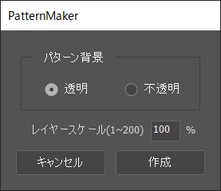
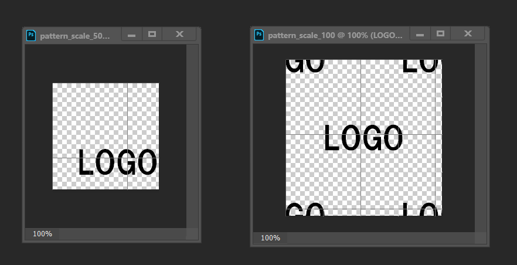

# PatternMaker
指定のレイヤーをパターン化してくれるツール

## 使い方
photoshopのドキュメントが開いてる状態、  
パターンにしたいレイヤーが選択された状態で  
こちらのPatternMakerを実行  
[DownLoad](PatternMaker.jsx) :point_left: **右クリック>名前を付けてリンク先を保存...**

## 概要
選択されたレイヤーの縦横の長い方の大きさを基準に正方形の2倍大きさの別ドキュメントを作成、  
選択されてたレイヤーを指定の拡縮（デフォルト100%、最大200%)にして各角に配置して  
パターン化する  

## sample  
  
左側の"LOGO"というレイヤーが選択されてる状態で実行した場合  
（複数のレイヤーが存在していても選択されたレイヤーのみ実行される）  
右側のように新たなドキュメントが生成される  
選択されてるレイヤーから作られるため、  
元素材（レイヤー）は中央に配置されてなくても、見切れていても問題ない
